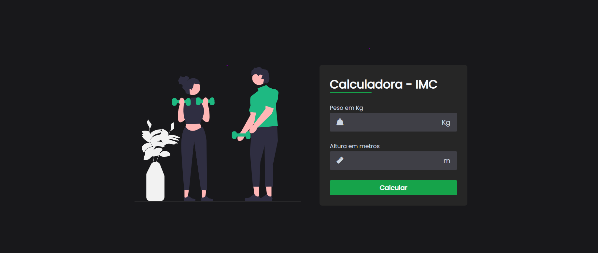

# calculadora-imc

Esta é uma página simples de uma calculadora de Índice de Massa Corporal (IMC), desenvolvida usando HTML, CSS e JavaScript. O IMC é uma medida que estima a quantidade de gordura corporal de uma pessoa com base em seu peso e altura. Esta calculadora permite que os usuários insiram seu peso e altura e obtenham seu IMC calculado instantaneamente.

## Recursos e Funcionalidades

- Interface amigável com design responsivo.
- Campos para entrada de peso em kg e altura em metros.
- Cálculo automático do IMC assim que o formulário for enviado.
- Exibição do resultado do IMC e uma descrição correspondente.
- Opção para exibir mais informações sobre o IMC com um link externo.

## Tecnologias Utilizadas

- HTML: para estruturação da página.
- CSS: para estilização e layout.
- JavaScript: para cálculo do IMC e manipulação dos elementos da página.

## Como Usar

1. Abra o arquivo `index.html` em qualquer navegador web.
2. Insira seu peso em kg no campo "Peso em Kg".
3. Insira sua altura em metros no campo "Altura em metros".
4. Clique no botão "Calcular".
5. O resultado do IMC será exibido juntamente com uma descrição correspondente.

## Contribuição

Sinta-se à vontade para contribuir com melhorias, correções de bugs ou implementação de novos recursos. Você pode abrir um pull request neste repositório para enviar suas contribuições.

Esperamos que essa calculadora de IMC simples seja útil para entender melhor sua saúde e promover hábitos saudáveis. Divirta-se!

